# M031BSP_Software_SGPIO_I2C_Slave

M031 boot-selectable SGPIO target/slave and 2-wire SMBus slave example.

Update: `2026/06/24`

## Overview

- MCU / Series: `M031`
- Board: `M032 EVB or compatible M031/M032 target board`
- Toolchain: `Keil uVision5`
- Purpose:
  - Read `BP_TYPE` on `PF14` at boot to select SGPIO or 2-wire SMBus slave profile.
  - Capture SGPIO frames from an external SGPIO initiator/master when `BP_TYPE=0`.
  - Decode `SLOAD L0..L3 Raw` and `SDataOut` per-slot `ACT / LOCATE / FAIL` bits.
  - Respond as an I2C1 SMBus slave on PA2/PA3 when `BP_TYPE=1`.
  - Always expose two additional SMBus slave ports on I2C0 and USCI0.
  - Keep SGPIO and SMBus processing interrupt-driven and non-blocking so the heartbeat LED and main loop keep running.

## Hardware

- Debug UART:
  - `UART0`
  - `PB12 = UART0_RXD`, `PB13 = UART0_TXD`
  - Terminal setting: `115200 8N1`
- Debug heartbeat output:
  - Toggles from the timer service; if it stops, profile handling is blocking the main loop or IRQ path.
- Main peripheral(s):
  - SGPIO target/slave receive path implemented by a shared GPIO port ISR.
  - SMBus slave paths implemented by I2C0/I2C1/UI2C0 ISR handlers with software PEC.
  - `PF14` boot strap selects which profile owns PA2/PA3 for this boot.
- Test equipment:
  - External SGPIO initiator/master.
  - SMBus/I2C master.
  - Logic analyzer for `SCLK`, `SLOAD`, `SDATA OUT`, `SDA`, and `SCL`.

## Pin Map

| Function | Pin | Direction | Note |
| --- | --- | --- | --- |
| `UART0_RXD` | `PB12` | Input | Debug UART RX |
| `UART0_TXD` | `PB13` | Output | Debug UART TX |
| `BP_TYPE` | `PF14` | Input | `0=SGPIO`, `1=2 Wire SMBus slave`; sampled once at boot |
| `SGPIO_SLOAD` | `PA3` | Input | SGPIO profile only; sampled by `SCLK` |
| `SGPIO_SDATAOUT` | `PA0` | Input | Sampled by `SCLK`; data IRQ is disabled |
| `SGPIO_SCLK` | `PA2` | Input | SGPIO profile only; shared GPIO port ISR rising-edge sampler |
| `SMBus_I2C1_SDA` | `PA2` | Open-drain | `BP_TYPE=1` only; `I2C1_SDA`, addr `0x5A` |
| `SMBus_I2C1_SCL` | `PA3` | Open-drain | `BP_TYPE=1` only; `I2C1_SCL`, addr `0x5A` |
| `SMBus_I2C0_SDA` | `PC0` | Open-drain | Always initialized; addr `0x6A` |
| `SMBus_I2C0_SCL` | `PC1` | Open-drain | Always initialized; addr `0x6A` |
| `SMBus_USCI0_CLK` | `PD0` | Open-drain | Always initialized as USCI0 I2C SCL; addr `0x4A` |
| `SMBus_USCI0_DAT0` | `PD1` | Open-drain | Always initialized as USCI0 I2C SDA; addr `0x4A` |
| `GND` | `GND` | Ground | Common ground with SGPIO initiator |

External SGPIO wiring:

| Initiator signal | Direction into M032 | M032 pin |
| --- | --- | --- |
| `SCLK` | Input clock | `PA2 GPIO input` |
| `SDATA OUT` | Input data | `PA0 GPIO input` |
| `SLOAD` | Input frame marker | `PA3 GPIO input` |
| `GND` | Common reference | `GND` |

External SMBus wiring:

| SMBus port | SMBus signal | M032 pin | Address |
| --- | --- | --- | --- |
| `I2C1` | `SDA` | `PA2 / I2C1_SDA` | `0x5A` |
| `I2C1` | `SCL` | `PA3 / I2C1_SCL` | `0x5A` |
| `I2C0` | `SDA` | `PC0 / I2C0_SDA` | `0x6A` |
| `I2C0` | `SCL` | `PC1 / I2C0_SCL` | `0x6A` |
| `USCI0` | `SCL` | `PD0 / USCI0_CLK` | `0x4A` |
| `USCI0` | `SDA` | `PD1 / USCI0_DAT0` | `0x4A` |
| all | `GND` | `GND` | common reference |

## Build Environment

- BSP / SDK: Nuvoton M031 BSP.
- IDE / compiler: Keil uVision5 project.
- Project file: [`SampleCode/Template/Keil/Template.uvprojx`](SampleCode/Template/Keil/Template.uvprojx)
- Main source path: [`SampleCode/Template`](SampleCode/Template)
- Output image: Keil project output under `SampleCode/Template/Keil/obj/`.

## Project Layout

- [`SampleCode/Template/main.c`](SampleCode/Template/main.c)
  - System init, UART0 init, timer service, heartbeat LED, `BP_TYPE` sampling, and profile dispatch.
- [`SampleCode/Template/sgpio_slave.c`](SampleCode/Template/sgpio_slave.c)
  - SGPIO shared GPIO port ISR receiver, frame capture, decode, stability filter, and debug log.
- [`SampleCode/Template/sgpio_slave.h`](SampleCode/Template/sgpio_slave.h)
  - SGPIO pin macros and public API.
- [`SampleCode/Template/smbus_slave.c`](SampleCode/Template/smbus_slave.c)
  - Shared SMBus/PMBus command, PEC, protocol, event, and user hook core.
- [`SampleCode/Template/smbus_slave.h`](SampleCode/Template/smbus_slave.h)
  - SMBus addresses, command flags, command codes, per-port init/process APIs, and user extension API.
- [`SampleCode/Template/smbus_slave_core.h`](SampleCode/Template/smbus_slave_core.h)
  - Internal shared SMBus context and core API used by each bus adapter.
- [`SampleCode/Template/smbus_slave_i2c0.c`](SampleCode/Template/smbus_slave_i2c0.c)
  - I2C0 SMBus slave adapter for `PC0/PC1`, address `0x6A`.
- [`SampleCode/Template/smbus_slave_i2c1.c`](SampleCode/Template/smbus_slave_i2c1.c)
  - I2C1 SMBus slave adapter for `PA2/PA3`, address `0x5A`, enabled only when `BP_TYPE=1`.
- [`SampleCode/Template/smbus_slave_usci0.c`](SampleCode/Template/smbus_slave_usci0.c)
  - USCI0/UI2C0 SMBus slave adapter for `PD0/PD1`, address `0x4A`.
- [`SampleCode/Template/timer_service.c`](SampleCode/Template/timer_service.c)
  - Timer task dispatch used by the heartbeat path.
- [`docs/SGPIO_PROTOCOL_CONTRACT.md`](docs/SGPIO_PROTOCOL_CONTRACT.md)
  - Cross-project SGPIO protocol contract between the SGPIO initiator and this M032 target.

## Firmware Behavior

### Power-on

Expected SGPIO boot log includes the timer task IDs, `BP_TYPE=0`, and SGPIO pin-role messages:

```text
task1 id = 0
task2 id = 1
task3 id = 2
BP_TYPE(PF14)=0 -> SGPIO profile
PA3/SLOAD GPIO input sampled by SCLK
PA0/SDATAOUT GPIO input sampled by SCLK
PA2/SCLK shared GPIO ISR rising sampler
SGPIO GPIO ISR RX path, no SDATAIN TX
PC0/I2C0_SDA SMBus slave open-drain
PC1/I2C0_SCL SMBus slave open-drain
I2C0 SMBus slave addr7=0x6A, PEC enabled in software
PD0/USCI0_CLK SMBus slave open-drain
PD1/USCI0_DAT0 SMBus slave open-drain
USCI0 SMBus slave addr7=0x4A, PEC enabled in software
SMBus commands: PMBUS_REVISION, MFR_ID, MFR_MODEL, CLEAR_FAULTS
```

Expected SMBus boot log includes `BP_TYPE=1`, I2C1 pin-role messages, the always-on I2C0/USCI0 ports, and the active slave addresses:

```text
BP_TYPE(PF14)=1 -> 2 Wire SMBus slave profile
PA2/I2C1_SDA SMBus slave open-drain
PA3/I2C1_SCL SMBus slave open-drain
I2C1 SMBus slave addr7=0x5A, PEC enabled in software
PC0/I2C0_SDA SMBus slave open-drain
PC1/I2C0_SCL SMBus slave open-drain
I2C0 SMBus slave addr7=0x6A, PEC enabled in software
PD0/USCI0_CLK SMBus slave open-drain
PD1/USCI0_DAT0 SMBus slave open-drain
USCI0 SMBus slave addr7=0x4A, PEC enabled in software
SMBus commands: PMBUS_REVISION, MFR_ID, MFR_MODEL, CLEAR_FAULTS
```

Reference power-on log:

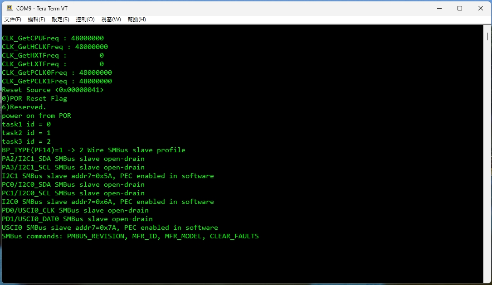

### Main Loop

The main loop must remain lightweight:

1. `TimerService_Dispatch()` keeps periodic tasks alive.
2. `TMR1_IRQHandler()` calls `SMBusSlave_I2C0_Timer1ms()`, `SMBusSlave_USCI0_Timer1ms()`, and `SMBusSlave_I2C1_Timer1ms()` when `BP_TYPE=1` for software SCL-low timeout sampling.
3. `SMBusSlave_I2C0_Process()` and `SMBusSlave_USCI0_Process()` run every loop.
4. `SGPIO_Process()` runs only when `BP_TYPE=0`.
5. `SMBusSlave_I2C1_Process()` runs only when `BP_TYPE=1`.
6. SGPIO bit capture, SMBus byte transfer, and SMBus SCL-low sampling are not done in the polling loop.
7. `printf()` must not be called from SGPIO or SMBus ISR paths.

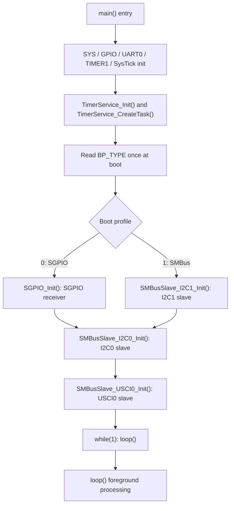

Timer1 1 ms ISR:

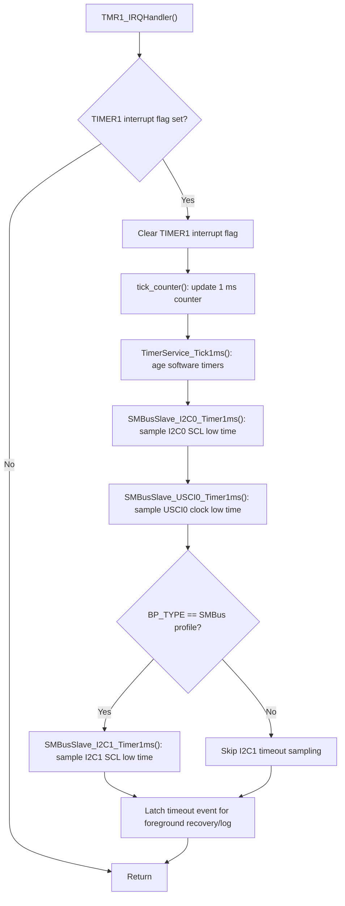

Foreground loop:

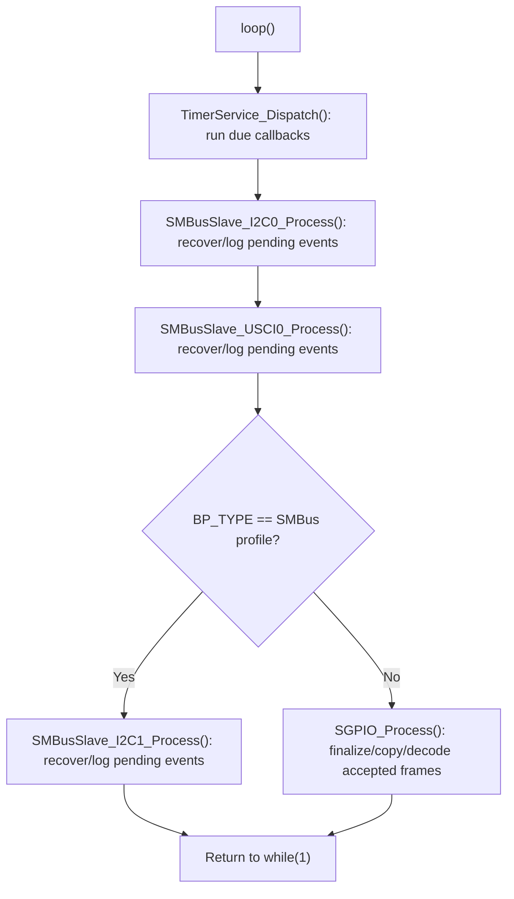

### SMBus Slave Profile

The SMBus protocol core is shared by three independent slave instances. I2C0 and USCI0 are initialized on every boot. I2C1 is initialized only when `BP_TYPE=1`, because I2C1 shares PA2/PA3 with the SGPIO profile.

- Addresses:
  - I2C1: `0x5A` 7-bit, pins `PA2/I2C1_SDA`, `PA3/I2C1_SCL`.
  - I2C0: `0x6A` 7-bit, pins `PC0/I2C0_SDA`, `PC1/I2C0_SCL`.
  - USCI0/UI2C0: `0x4A` 7-bit, pins `PD0/USCI0_CLK`, `PD1/USCI0_DAT0`. 
  - `0x7A` is avoided because it is in the I2C reserved `0x78-0x7F` range and its address byte collides with the 10-bit prefix pattern.
- PEC: software CRC-8 polynomial `0x07`; repeated-start reads append PEC.
- __Timeout__: TMR1 samples each SMBus SCL/CLK pin once per millisecond through the `SMBUS_SLAVE_*` pin defines and raises a software clock-low timeout after `SMBUS_SLAVE_CLOCK_LOW_TIMEOUT_MS`. `SMBusSlave_*_Process()` only handles the pending recovery/log events. USCI0 `TOCNT` is disabled by default because it is an interrupt-service timeout, not an SMBus clock-low timer.
- __Enabled SMBus clock pins must idle high with pull-up__. If any enabled SCL/CLK pin is left floating or held low, the software clock-low monitor will repeatedly report timeout and trigger slave recovery. I2C0 and USCI0 are initialized on every boot, so their clock pins also need a valid idle-high level even when only I2C1 is under test.
- Representative commands:
  - `PMBUS_REVISION` (`0x98`) as Read Byte with PEC.
  - `MFR_ID` (`0x99`) and `MFR_MODEL` (`0x9A`) as Block Read with PEC.
  - `CLEAR_FAULTS` (`0x03`) as Send Byte with optional write-side PEC.
- Read Word with PEC, Block Write with PEC, and Write Byte with PEC are exposed through the user extension APIs and command flags.
- User extension API:
  - All hooks include `port_id`, using `SMBUS_SLAVE_PORT_I2C1`, `SMBUS_SLAVE_PORT_I2C0`, or `SMBUS_SLAVE_PORT_USCI0`.
  - `SMBusSlave_UserGetCommandFlags(port_id, command, flags)`
  - `SMBusSlave_UserReadByte(port_id, command, value)`
  - `SMBusSlave_UserReadWord(port_id, command, value)`
  - `SMBusSlave_UserBlockRead(port_id, command, data, length)`
  - `SMBusSlave_UserSendByte(port_id, command, pec_present, pec_valid)`
  - `SMBusSlave_UserWriteByte(port_id, command, value, pec_present, pec_valid)`
  - `SMBusSlave_UserBlockWrite(port_id, command, data, length, pec_present, pec_valid)`
  - `SMBusSlave_UserTimeoutError(port_id)`

#### PMBus Capture Examples

These captures show the minimum healthy PMBus scan signals on each slave interface:

- `PMBUS_REVISION` (`0x98`): Read Byte with PEC. The host writes the command byte with PEC, issues repeated START, and the slave returns `0x33` plus read PEC.
- `MFR_ID` (`0x99`): Block Read with PEC. The slave returns byte count, ASCII payload `"MFR_ID_001"`, and read PEC.
- `MFR_MODEL` (`0x9A`): Block Read with PEC. The slave returns byte count, ASCII payload `"MFR_MODEL_001"`, and read PEC.
- UART logs confirm the firmware RX decode, selected protocol, TX payload, and PEC status.

I2C0 PMBus slave, address `0x6A`, pins `PC0/PC1`:

`PMBUS_REVISION (0x98)` Read Byte with PEC:

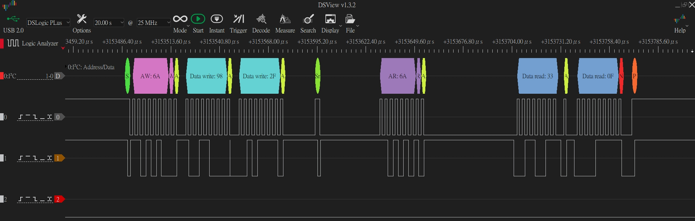

`MFR_ID (0x99)` Block Read with PEC:

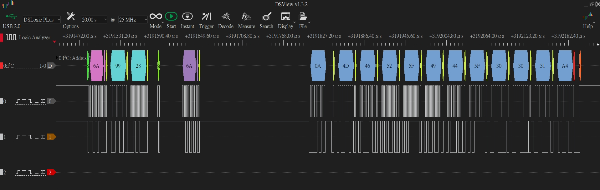

`MFR_MODEL (0x9A)` Block Read with PEC:

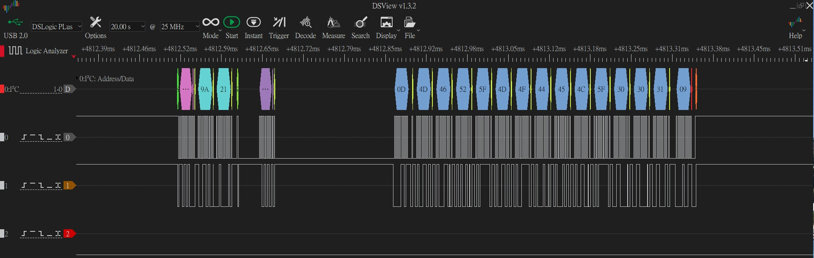

I2C0 UART command log:

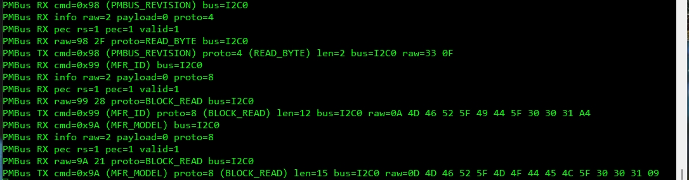

I2C1 PMBus slave, address `0x5A`, pins `PA2/PA3`:

`PMBUS_REVISION (0x98)` Read Byte with PEC:

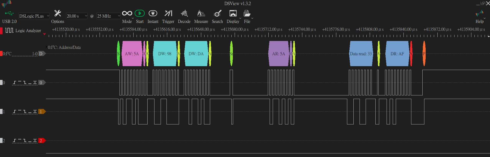

`MFR_ID (0x99)` Block Read with PEC:

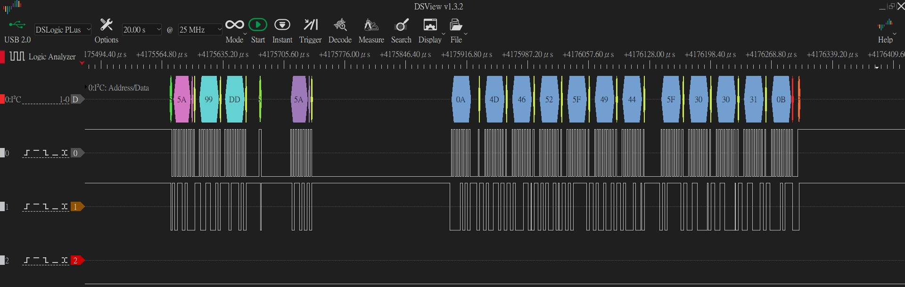

`MFR_MODEL (0x9A)` Block Read with PEC:

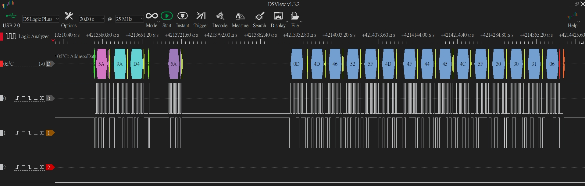

I2C1 UART command log:

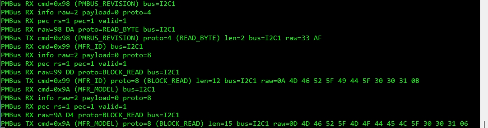

USCI0 PMBus slave, address `0x4A`, pins `PD0/PD1`:

`PMBUS_REVISION (0x98)` Read Byte with PEC:

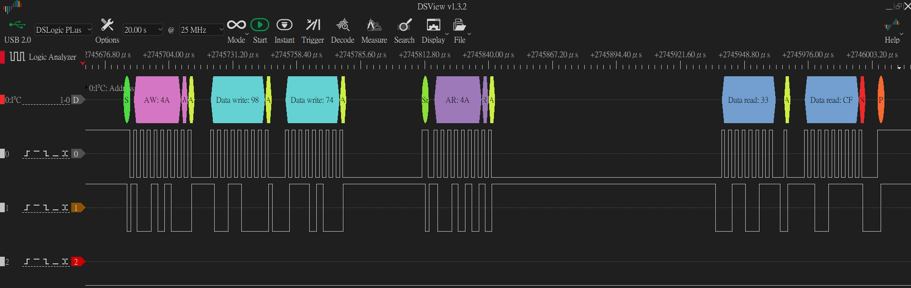

`MFR_ID (0x99)` Block Read with PEC:

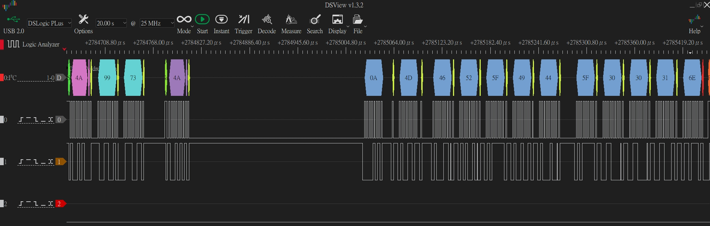

`MFR_MODEL (0x9A)` Block Read with PEC:

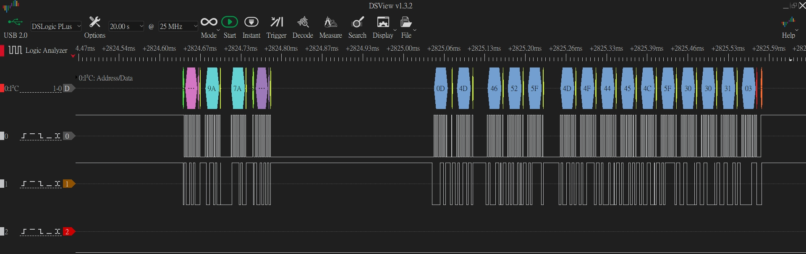

USCI0 UART command log:

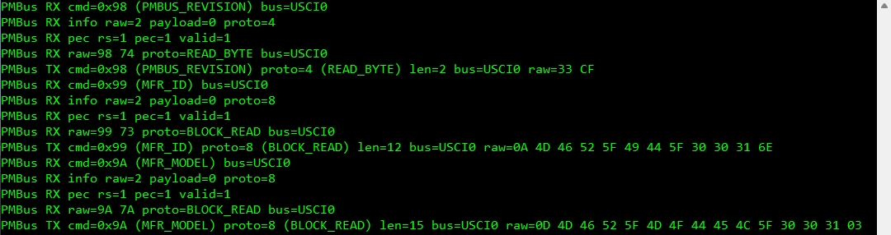

### SGPIO Signal Handling Flow

The current receiver uses `SCLK` as the only active SGPIO receive interrupt.

1. `SLOAD` is normally high before a frame.
2. The SGPIO initiator drives `SLOAD` low for the low-sync run.
3. On every `GPIO : SCLOCK` rising edge, the shared GPIO port ISR runs.
4. At ISR entry, firmware immediately samples:
   - `GPIO : SLOAD`
   - `GPIO : SDATA OUT`
5. `SGPIO_OnClockRisingSampledIrq(sload_sample, sdata_sample)` updates the in-RAM capture state.
6. While `SLOAD=0`, the receiver counts low-sync clocks.
7. After at least `SGPIO_LOW_SYNC_MIN_BITS` low clocks, a `SLOAD=1` sample on a `GPIO : SCLOCK` rising edge is treated as the restart marker.
8. The restart-marker clock is not stored as slot data.
9. The next four `GPIO : SCLOCK` rising edges provide `SLOAD L0..L3 Raw`.
10. `SDATA OUT` slot bits start immediately after the marker and are captured in parallel with the `L0..L3` clocks.
11. Each slot consumes three `SDATA OUT` bits in this order:
    - bit 0: `ACT`
    - bit 1: `LOCATE`
    - bit 2: `FAIL`
12. `SGPIO_Process()` finalizes the frame after `SGPIO_FRAME_GAP_TIMEOUT_MS` with no new `GPIO : SCLOCK` edge, then decodes and logs the result.

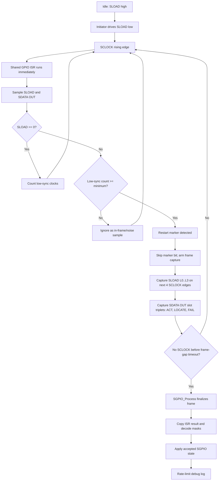

Important ISR rule:

- `SGPIO_SLAVE_GPIO_IRQHandler` maps to `GPABGH_IRQHandler()` for `PA2/SCLK`.
- The `GPIO : SCLOCK` flag check must remain the first top-level branch.
- Any future unrelated GPIO interrupt handling must be added below the `GPIO : SCLOCK` block so SGPIO sampling is not delayed.
- `SLOAD` falling/rising edges do not create frame events by themselves in this implementation.
- `SLOAD` is only meaningful when sampled at `GPIO : SCLOCK` rising edge.
- This avoids treating in-frame `SLOAD L0..L3` transitions as false frame starts.

## Raw Bit Decode

Raw SGPIO bytes are printed in capture order and decoded __LSB-first__.

For a raw byte:

```text
raw byte = 0x38
binary   = 0011 1000  (normal MSB-left display)
LSB bits = bit0..bit7 = 0,0,0,1,1,1,0,0
```

The SGPIO decoder consumes the __LSB__ bit stream:

```text
bit index = byte_index * 8 + bit_in_byte
bit value = (raw[byte_index] >> bit_in_byte) & 0x01
```

Slot mapping:

```text
Slot N ACT    = bit (N * 3 + 0)
Slot N LOCATE = bit (N * 3 + 1)
Slot N FAIL   = bit (N * 3 + 2)
```

SFF-8485 OD bit position mapping:

- `ODx.y` is the SFF-8485 SDataOut bit position name.
- `x` is the slot / drive index.
- `y` is the bit index inside that slot triplet.
- Current decoder semantics map `ODx.0 -> ACT`, `ODx.1 -> LOCATE`, and `ODx.2 -> FAIL`.

| SFF-8485 bit | Raw bit index | Raw byte.bit | Current semantic | Mask bit |
| --- | ---: | --- | --- | ---: |
| `OD0.0` | 0 | `raw[0].bit0` | `Slot 0 ACT` | 0 |
| `OD0.1` | 1 | `raw[0].bit1` | `Slot 0 LOCATE` | 0 |
| `OD0.2` | 2 | `raw[0].bit2` | `Slot 0 FAIL` | 0 |
| `OD1.0` | 3 | `raw[0].bit3` | `Slot 1 ACT` | 1 |
| `OD1.1` | 4 | `raw[0].bit4` | `Slot 1 LOCATE` | 1 |
| `OD1.2` | 5 | `raw[0].bit5` | `Slot 1 FAIL` | 1 |
| `OD2.0` | 6 | `raw[0].bit6` | `Slot 2 ACT` | 2 |
| `OD2.1` | 7 | `raw[0].bit7` | `Slot 2 LOCATE` | 2 |
| `OD2.2` | 8 | `raw[1].bit0` | `Slot 2 FAIL` | 2 |
| `OD3.0` | 9 | `raw[1].bit1` | `Slot 3 ACT` | 3 |
| `OD3.1` | 10 | `raw[1].bit2` | `Slot 3 LOCATE` | 3 |
| `OD3.2` | 11 | `raw[1].bit3` | `Slot 3 FAIL` | 3 |
| `OD4.0` | 12 | `raw[1].bit4` | `Slot 4 ACT` | 4 |
| `OD4.1` | 13 | `raw[1].bit5` | `Slot 4 LOCATE` | 4 |
| `OD4.2` | 14 | `raw[1].bit6` | `Slot 4 FAIL` | 4 |
| `OD5.0` | 15 | `raw[1].bit7` | `Slot 5 ACT` | 5 |
| `OD5.1` | 16 | `raw[2].bit0` | `Slot 5 LOCATE` | 5 |
| `OD5.2` | 17 | `raw[2].bit1` | `Slot 5 FAIL` | 5 |
| `OD6.0` | 18 | `raw[2].bit2` | `Slot 6 ACT` | 6 |
| `OD6.1` | 19 | `raw[2].bit3` | `Slot 6 LOCATE` | 6 |
| `OD6.2` | 20 | `raw[2].bit4` | `Slot 6 FAIL` | 6 |
| `OD7.0` | 21 | `raw[2].bit5` | `Slot 7 ACT` | 7 |
| `OD7.1` | 22 | `raw[2].bit6` | `Slot 7 LOCATE` | 7 |
| `OD7.2` | 23 | `raw[2].bit7` | `Slot 7 FAIL` | 7 |
| `OD8.0` | 24 | `raw[3].bit0` | `Slot 8 ACT` | 8 |
| `OD8.1` | 25 | `raw[3].bit1` | `Slot 8 LOCATE` | 8 |
| `OD8.2` | 26 | `raw[3].bit2` | `Slot 8 FAIL` | 8 |
| `OD9.0` | 27 | `raw[3].bit3` | `Slot 9 ACT` | 9 |
| `OD9.1` | 28 | `raw[3].bit4` | `Slot 9 LOCATE` | 9 |
| `OD9.2` | 29 | `raw[3].bit5` | `Slot 9 FAIL` | 9 |
| `OD10.0` | 30 | `raw[3].bit6` | `Slot 10 ACT` | 10 |
| `OD10.1` | 31 | `raw[3].bit7` | `Slot 10 LOCATE` | 10 |
| `OD10.2` | 32 | `raw[4].bit0` | `Slot 10 FAIL` | 10 |
| `OD11.0` | 33 | `raw[4].bit1` | `Slot 11 ACT` | 11 |
| `OD11.1` | 34 | `raw[4].bit2` | `Slot 11 LOCATE` | 11 |
| `OD11.2` | 35 | `raw[4].bit3` | `Slot 11 FAIL` | 11 |
| `OD12.0` | 36 | `raw[4].bit4` | `Slot 12 ACT` | 12 |
| `OD12.1` | 37 | `raw[4].bit5` | `Slot 12 LOCATE` | 12 |
| `OD12.2` | 38 | `raw[4].bit6` | `Slot 12 FAIL` | 12 |
| `OD13.0` | 39 | `raw[4].bit7` | `Slot 13 ACT` | 13 |
| `OD13.1` | 40 | `raw[5].bit0` | `Slot 13 LOCATE` | 13 |
| `OD13.2` | 41 | `raw[5].bit1` | `Slot 13 FAIL` | 13 |
| `OD14.0` | 42 | `raw[5].bit2` | `Slot 14 ACT` | 14 |
| `OD14.1` | 43 | `raw[5].bit3` | `Slot 14 LOCATE` | 14 |
| `OD14.2` | 44 | `raw[5].bit4` | `Slot 14 FAIL` | 14 |
| `OD15.0` | 45 | `raw[5].bit5` | `Slot 15 ACT` | 15 |
| `OD15.1` | 46 | `raw[5].bit6` | `Slot 15 LOCATE` | 15 |
| `OD15.2` | 47 | `raw[5].bit7` | `Slot 15 FAIL` | 15 |

Example:

```text
raw: 38 8E C3 00

0x38 LSB bits: 0 0 0 1 1 1 0 0
0x8E LSB bits: 0 1 1 1 0 0 0 1
0xC3 LSB bits: 1 1 0 0 0 0 1 1
0x00 LSB bits: 0 0 0 0 0 0 0 0
```

Grouped by slot triplets:

```text
S0=000
S1=111
S2=000
S3=111
S4=000
S5=111
S6=000
S7=011
```

In each `Sx=abc` triplet:

- `a = ACT`
- `b = LOCATE`
- `c = FAIL`

The log also prints mask form:

```text
masks: ACT=0x002A LOCATE=0x00AA FAIL=0x00AA
slots: ACT=1,3,5 LOCATE=1,3,5,7 FAIL=1,3,5,7
```

Mask bit meaning:

- bit 0 = Slot 0
- bit 1 = Slot 1
- bit 2 = Slot 2
- and so on

## Captured Decode Examples

Logic analyzer channels used by the captured examples:

- `CH0 : SCLOCK`
- `CH1 : SDATA OUT`
- `CH2 : SLOAD`

Decode rule reminder:

- `SLOAD` low run plus a sampled `SLOAD=1` restart marker defines the frame boundary.
- `SDATA OUT` is sampled on every `SCLOCK` rising edge after the restart marker.
- Each slot is decoded as a 3-bit triplet: `Sx=ACT,LOCATE,FAIL`.
- Raw bytes are decoded LSB-first, so `raw: 38 8E C3 00` does not read like a normal MSB-left binary string.

| Example | Raw bytes | Slot triplets | Masks | Decoded active slots |
| --- | --- | --- | --- | --- |
| 8-slot alternating | `38 8E C3 00` | `S0=000 S1=111 S2=000 S3=111 S4=000 S5=111 S6=000 S7=011` | `ACT=0x002A LOCATE=0x00AA FAIL=0x00AA` | `ACT=1,3,5`, `LOCATE=1,3,5,7`, `FAIL=1,3,5,7` |
| 8-slot mixed | `78 9C 24 00` | `S0=000 S1=111 S2=100 S3=011 S4=100 S5=100 S6=100 S7=100` | `ACT=0x00F6 LOCATE=0x000A FAIL=0x000A` | `ACT=1,2,4,5,6,7`, `LOCATE=1,3`, `FAIL=1,3` |
| 16-slot repeating | `11 15 51 11 15 51` | `S0=100 S1=010 S2=001 S3=010 S4=100 S5=010 S6=001 S7=010`, `S8=100 S9=010 S10=001 S11=010 S12=100 S13=010 S14=001 S15=010` | `ACT=0x1111 LOCATE=0xAAAA FAIL=0x4444` | `ACT=0,4,8,12`, `LOCATE=1,3,5,7,9,11,13,15`, `FAIL=2,6,10,14` |

### Example: `38 8E C3 00`

The LA annotation groups `SDATA OUT` bits into slot triplets after the SLOAD restart marker. The UART log confirms the same raw bytes, triplets, masks, and slot list.


### Example: `78 9C 24 00`

This example verifies that mixed slot states are not limited to all-on/all-off patterns. Slot 2 and slots 4 through 7 assert only `ACT`, while slots 1 and 3 assert all three signals differently according to the triplet values.

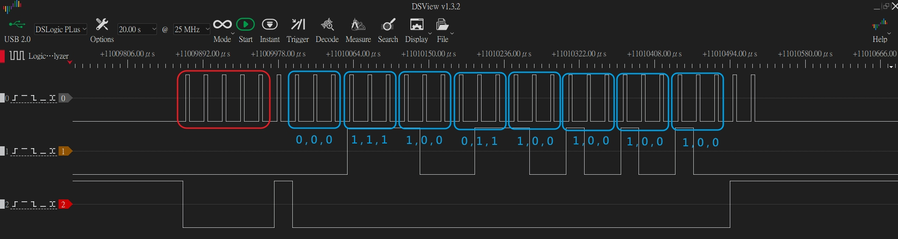

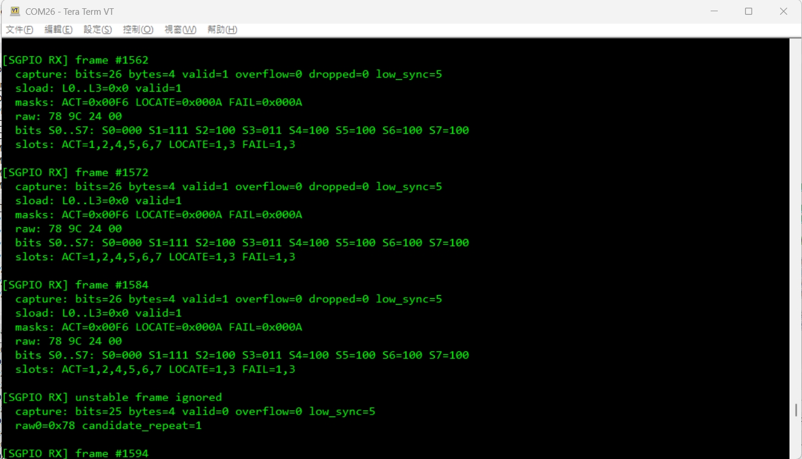

### Example: `11 15 51 11 15 51`

This is a full 16-slot capture. The log prints `S0..S7` and `S8..S15` separately so the 48-bit SDataOut stream can be checked without wrapping into an unreadable single line.

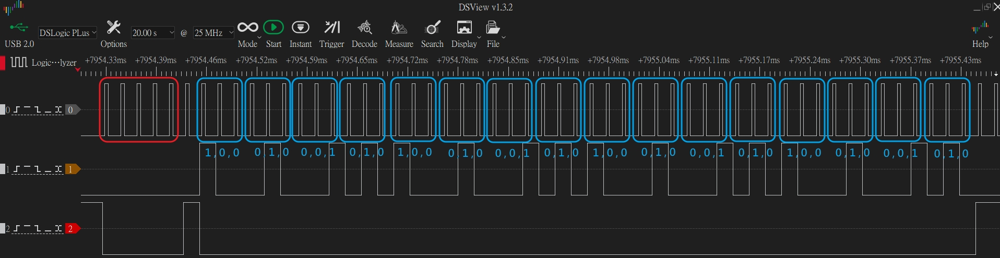

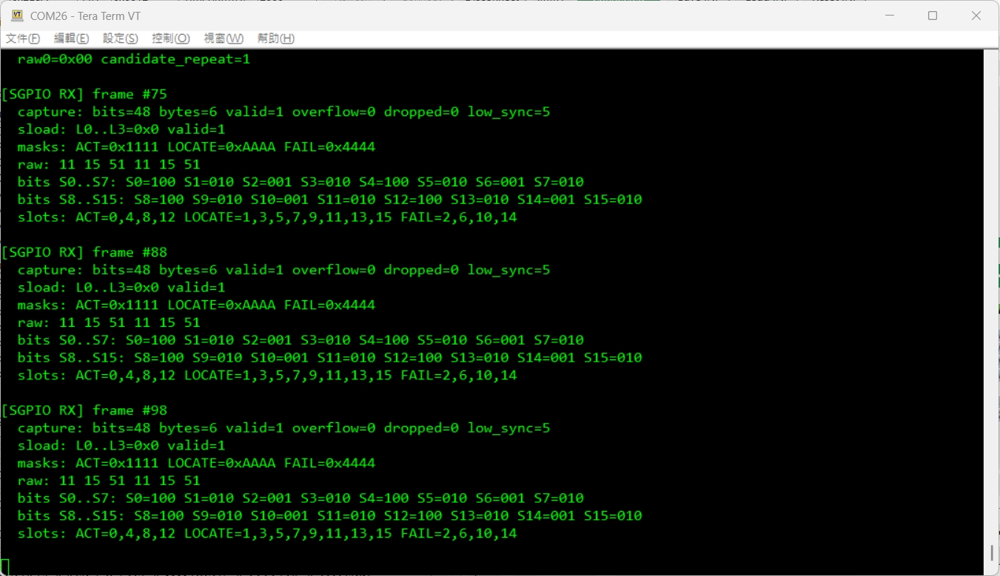

## Configuration

Main config files:

- [`SampleCode/Template/main.c`](SampleCode/Template/main.c)
- [`SampleCode/Template/sgpio_slave.h`](SampleCode/Template/sgpio_slave.h)
- [`SampleCode/Template/sgpio_slave.c`](SampleCode/Template/sgpio_slave.c)
- [`SampleCode/Template/smbus_slave.h`](SampleCode/Template/smbus_slave.h)
- [`SampleCode/Template/smbus_slave.c`](SampleCode/Template/smbus_slave.c)
- [`SampleCode/Template/smbus_slave_core.h`](SampleCode/Template/smbus_slave_core.h)
- [`SampleCode/Template/smbus_slave_i2c0.c`](SampleCode/Template/smbus_slave_i2c0.c)
- [`SampleCode/Template/smbus_slave_i2c1.c`](SampleCode/Template/smbus_slave_i2c1.c)
- [`SampleCode/Template/smbus_slave_usci0.c`](SampleCode/Template/smbus_slave_usci0.c)

Boot profile select:

```c
#define BP_TYPE                                      (PF14)
#define BP_TYPE_PROFILE_SGPIO                       (0U)
#define BP_TYPE_PROFILE_SMBUS_SLAVE                 (1U)
```

Important SGPIO pin macros:

```c
#define SGPIO_SLAVE_SLOAD_PORT           (PA)
#define SGPIO_SLAVE_SLOAD_PIN_NUM        (3UL)
#define SGPIO_SLAVE_SLOAD_PIN_MASK       (BIT3)

#define SGPIO_SLAVE_SDOUT_PORT           (PA)
#define SGPIO_SLAVE_SDOUT_PIN_NUM        (0UL)
#define SGPIO_SLAVE_SDOUT_PIN_MASK       (BIT0)

#define SGPIO_SLAVE_SCLK_PORT            (PA)
#define SGPIO_SLAVE_SCLK_PIN_NUM         (2UL)
#define SGPIO_SLAVE_SCLK_PIN_MASK        (BIT2)

#define SGPIO_SLAVE_GPIO_IRQn            (GPIO_PAPBPGPH_IRQn)
#define SGPIO_SLAVE_GPIO_IRQHandler      GPABGH_IRQHandler

#define SGPIO_SLAVE_MAX_SLOTS            (16U)
#define SGPIO_SLAVE_RX_MAX_BYTES         (8U)
```

Important SMBus address and command macros:

```c
#define SMBUS_SLAVE_I2C1_ADDRESS_7BIT        (0x5AU)
#define SMBUS_SLAVE_I2C0_ADDRESS_7BIT        (0x6AU)
#define SMBUS_SLAVE_USCI0_ADDRESS_7BIT       (0x4AU)

#define SMBUS_SLAVE_I2C1_SDA                 (PA2)
#define SMBUS_SLAVE_I2C1_SCL                 (PA3)
#define SMBUS_SLAVE_I2C0_SDA                 (PC0)
#define SMBUS_SLAVE_I2C0_SCL                 (PC1)
#define SMBUS_SLAVE_USCI0_CLK                (PD0)
#define SMBUS_SLAVE_USCI0_DAT0               (PD1)

#define SMBUS_SLAVE_CLOCK_LOW_TIMEOUT_MS     (35U)
#define SMBUS_SLAVE_USCI0_TIMEOUT_INTERRUPT_ENABLE (0U)

#define SMBUS_SLAVE_PORT_I2C1                (0U)
#define SMBUS_SLAVE_PORT_I2C0                (1U)
#define SMBUS_SLAVE_PORT_USCI0               (2U)

#define SMBUS_SLAVE_PMBUS_CLEAR_FAULTS       (0x03U)
#define SMBUS_SLAVE_PMBUS_REVISION           (0x98U)
#define SMBUS_SLAVE_PMBUS_MFR_ID             (0x99U)
#define SMBUS_SLAVE_PMBUS_MFR_MODEL          (0x9AU)
```

Important internal timing/filter macros:

```c
#define SGPIO_LOW_SYNC_MIN_BITS            (5U)
#define SGPIO_SLOAD_RAW_BITS               (4U)
#define SGPIO_DATA_BITS_PER_SLOT           (3U)
#define SGPIO_FRAME_GAP_TIMEOUT_MS         (5UL)
#define SGPIO_FRAME_ARM_TIMEOUT_MS         (20UL)
#define SGPIO_FRAME_LOG_FIRST_N            (1UL)
#define SGPIO_FRAME_LOG_MIN_INTERVAL_MS    (1000UL)
#define SGPIO_FRAME_STABLE_REQUIRED        (2U)
#define SGPIO_UNSTABLE_LOG_MIN_INTERVAL_MS (3000UL)
```

## Test Flow

1. Connect the SGPIO initiator `SCLK/SDATA OUT/SLOAD/GND` to M032 `PA2/PA0/PA3/GND`.
2. Open a UART terminal on M032 `UART0`, `115200 8N1`.
3. Power on or reset M032.
4. Confirm the SGPIO startup log appears.
5. Confirm the debug heartbeat output continues toggling.
6. Drive a valid SGPIO frame from the initiator.
7. Confirm the M032 UART log decodes the expected masks and slot list.
8. If frames are unstable, lower initiator `SCLK`, shorten wiring, and confirm the waveform with a logic analyzer.

## Validation

UART log should show valid frames such as:

```text
[SGPIO RX] frame #N
  capture: bits=26 bytes=4 valid=1 overflow=0 dropped=0 low_sync=5
  sload: L0..L3=0x0 valid=1
  masks: ACT=0x002A LOCATE=0x00AA FAIL=0x00AA
  raw: 38 8E C3 00
  bits: S0=000 S1=111 S2=000 S3=111 S4=000 S5=111 S6=000 S7=011
  slots: ACT=1,3,5 LOCATE=1,3,5,7 FAIL=1,3,5,7
```

External initiator result:

- Changing the initiator slot pattern should change M032 `ACT / LOCATE / FAIL` masks.

Scope / logic analyzer:

- `SLOAD` idles high between frames.
- A frame starts after `SLOAD` stays low for at least five `SCLK` rising edges.
- A sampled `SLOAD=1` on `SCLK` rising edge marks the restart marker.
- `SDATA OUT` must be stable around each `SCLK` rising edge.

## Troubleshooting

- If the debug heartbeat output stops:
  - Check for excessive `printf()` output.
  - Keep SGPIO and SMBus debug logs rate-limited.
  - Confirm no busy-wait or FIFO-drain loop was reintroduced into `SGPIO_Process()` or any `SMBusSlave_*_Process()`.
- If UART output stops at `PMBus RX cmd=0x` and then prints `HardFault!`:
  - Treat it as debug logging stack pressure first. The Keil project overrides __`Stack_Size` to `0x00000800`__; keep this override when `PMBUS_DEBUG_ENABLE=1`.
  - SMBus event snapshots are static per adapter to keep large debug buffers off the runtime stack.
  - Confirm the reset source on the next boot. `HardFault_Handler()` loops after printing the fault dump and does not intentionally reset the MCU.
- If SMBus logs show timeout:
  - Check whether that port's SCL pin is being held low: `PA3/I2C1_SCL`, `PC1/I2C0_SCL`, or `PD0/USCI0_CLK`.
  - __Confirm every enabled SMBus SCL/CLK pin has pull-up and idles high.__
  - Confirm common GND is present.
  - I2C0 and USCI0 are initialized on every boot; leaving their clock pins floating or low will cause repeated timeout/recovery logs even if the active host test targets only I2C1.
  - Confirm only the SMBus profile owns PA2/PA3 when `BP_TYPE=1`.
  - Keep the software SCL-low monitor in `TMR1_IRQHandler()`; do not move it back into `SMBusSlave_*_Process()`.
  - Keep `SMBUS_SLAVE_USCI0_TIMEOUT_INTERRUPT_ENABLE` at `0U` when I2C0/I2C1/USCI0 are externally tied to the same SMBus lines.
- If logs show frequent `unstable frame ignored`:
  - Lower the initiator `SCLK`.
  - Check common GND and wire length.
  - Capture `SCLK`, `SLOAD`, and `SDATA OUT` with a logic analyzer.
- If decoded slots are shifted:
  - Confirm `SLOAD` low-sync and restart marker are visible.
  - Confirm data is interpreted LSB-first.
  - Confirm slot order is `ACT`, `LOCATE`, `FAIL`.
- If `valid=0` or `bits` is unexpected:
  - Check whether the frame ended too early or too late.
  - Review `SGPIO_FRAME_GAP_TIMEOUT_MS`.
  - Confirm the initiator slot count matches the intended test.

## Notes

- The SGPIO profile is RX-only for the M032 target.
- `SDATA IN` target-to-initiator transmit is intentionally not implemented yet.
- `PA0` remains a plain GPIO input in the SGPIO profile; `SDATA OUT` is sampled only by the `SCLK` rising ISR.
- `PA3 / SLOAD` interrupt is disabled in the SGPIO profile; `SLOAD` is sampled only by the `SCLK` rising ISR.
- I2C0 and USCI0 SMBus slave ports are initialized on every boot.
- The I2C1 SMBus slave profile uses PA2/PA3 and does not initialize the SGPIO GPIO ISR.
- Keep `SGPIO_Process()` non-blocking. It should finalize/copy/decode/print only.
- Keep all `SMBusSlave_*_Process()` functions non-blocking. They should recover/log from background context only.
- Keep `SampleCode/Template/Keil/Template.uvprojx` assembler define __`Stack_Size=0x00000800`__ for PMBus debug logging builds.
- Keep SMBus pin assignment in `smbus_slave.h` so timeout sampling, GPIO bus clear, and peripheral MFP setup use the same definitions.
- Keep capture ownership in the `SCLK` rising-edge sampling path unless the timing model is re-evaluated.
- Before publishing, confirm this README contains no local absolute paths or sensitive directory names.

## Related Files

- [`SampleCode/Template/main.c`](SampleCode/Template/main.c)
- [`SampleCode/Template/sgpio_slave.c`](SampleCode/Template/sgpio_slave.c)
- [`SampleCode/Template/sgpio_slave.h`](SampleCode/Template/sgpio_slave.h)
- [`SampleCode/Template/smbus_slave.c`](SampleCode/Template/smbus_slave.c)
- [`SampleCode/Template/smbus_slave.h`](SampleCode/Template/smbus_slave.h)
- [`SampleCode/Template/smbus_slave_core.h`](SampleCode/Template/smbus_slave_core.h)
- [`SampleCode/Template/smbus_slave_i2c0.c`](SampleCode/Template/smbus_slave_i2c0.c)
- [`SampleCode/Template/smbus_slave_i2c1.c`](SampleCode/Template/smbus_slave_i2c1.c)
- [`SampleCode/Template/smbus_slave_usci0.c`](SampleCode/Template/smbus_slave_usci0.c)
- [`SampleCode/Template/timer_service.c`](SampleCode/Template/timer_service.c)
- [`SampleCode/Template/Keil/Template.uvprojx`](SampleCode/Template/Keil/Template.uvprojx)
- [`docs/SGPIO_PROTOCOL_CONTRACT.md`](docs/SGPIO_PROTOCOL_CONTRACT.md)

## Reference Specifications

- SFF-8485: Serial GPIO bus framing and signal timing.
- SFF-8489: IBPI interpretation for drive slot indicators.
- SMBus/PMBus command behavior is represented by the firmware command handlers in `smbus_slave.c`.

## Revision

- `2026/06/24`: initial version.
